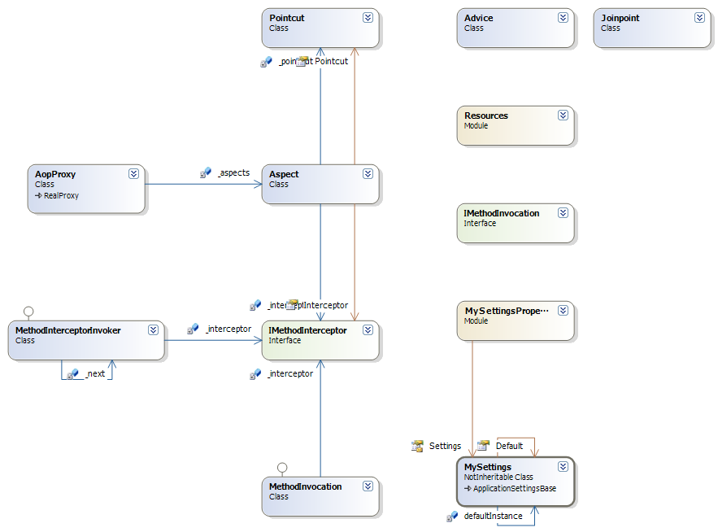

# Aop

Based on the AOP Alliance's Javadoc AOP Alliance specifications, I tried creating and implementing an interface on VB.NET.

## Class Diagram

## License

Microsoft Public License (MS-PL)

http://opensource.org/licenses/MS-PL
